<p align="center">
  
</p>

<h1 align="center">Arte na Cozinha — Site de delivery próprio para confeitaria</h1>

<p align="center">
  Trabalho de Conclusão de Curso · Técnico em Desenvolvimento de Sistemas<br>
  <strong>Etec Fernando Prestes</strong> · Centro Paula Souza · Sorocaba · 2026<br>
  Thiago Luís · Adrian Martins · Henrique Petrone
</p>

---

## Sobre o projeto

Site de delivery **exclusivo da confeitaria Arte na Cozinha**, que funciona de forma parecida com o iFood,
mas **sem comissão por pedido**. O cliente consulta o cardápio, monta o carrinho, faz o pedido **sem cadastro**,
escolhe pagar **pelo site ou na entrega** e acompanha o status em tempo real. A confirmação é feita pelo
**WhatsApp**. A loja gerencia pedidos, produtos, preços e promoções em um **painel administrativo**.

| Tela do cliente | Painel da loja |
|---|---|
| Cardápio com busca, categorias e promoção da semana (Figura 8) | Pedidos do dia com indicadores e ações (Figura 11) |
| Carrinho com **frete calculado pela distância** e finalização sem cadastro (Figura 9) | Produtos e preços (cadastrar, editar, ocultar, excluir) |
| Acompanhamento do pedido em tempo real (Figura 10) | Promoções com **tempo para acabar** (automático ou manual) |
| Contagem regressiva das promoções | Configurações: endereço da loja, frete, prazos, WhatsApp, senha |
| **Conta do cliente** (nome + WhatsApp): endereço salvo, pedidos anteriores e "pedir de novo" | **Categorias editáveis**: criar, renomear, reordenar e excluir |
| Botão do **WhatsApp da loja** na página principal | Edição de produto separada das promoções |

## Novidades da versão 1.2

### 👤 Conta do cliente (login simplificado)

O cliente entra só com **nome e WhatsApp**, sem senha (`entrar.php`). Na **Minha conta** (`conta.php`) ele tem:

- **endereço salvo**: nome, WhatsApp e endereço já vêm preenchidos no carrinho;
- **pedidos anteriores**, com status e detalhes;
- **"Pedir de novo"**: coloca no carrinho os itens de um pedido antigo que ainda estão no cardápio, com os preços de hoje;
- **pedidos em andamento** no topo, com atalho para acompanhar.

A conta é criada **sozinha no primeiro pedido**. Se o WhatsApp já tem pedidos, o primeiro nome precisa conferir com o
cadastro (sem diferenciar maiúsculas e acentos). Para evitar tentativas de adivinhar, são permitidas 8 tentativas a
cada 10 minutos.

### 💬 WhatsApp da loja

- **Botão flutuante** com a logo do WhatsApp na página principal: abre a conversa com a loja **sem mensagem pronta**.
- O cliente **não envia mais o resumo** ao finalizar. A **loja** confirma: ao clicar em **Aceitar** no painel, o atalho
  "Avisar cliente no WhatsApp" já leva a confirmação com o resumo do pedido (RF08).

### 🧾 Carrinho mais simples

O quadro de frete mostra **só o resultado**: *"Frete calculado: R$ 18,81"* e, abaixo, *"Entrega estimada em 40–55 min"*.
O cálculo (km × valor) fica no servidor.

### ⏳ Contagem das promoções

A contagem mostra **só a maior unidade** e vai mudando conforme o fim se aproxima: **6d** → no último dia **23h** →
na última hora **45min** → no último minuto **30s**.

### 🗂️ Painel

- **Categorias** (`admin/categorias.php`): criar, renomear (os produtos são atualizados juntos), mudar a ordem dos
  botões do cardápio e excluir (movendo os produtos para outra categoria). Categorias sem produtos ficam escondidas
  do cliente.
- **Editar produto** cuida só do item (nome, descrição, categoria, preço, foto e disponibilidade).
  **Promoções ficam só na aba Promoções.** Se o produto estiver em promoção, a edição só mostra um aviso.

## Novidades da versão 1.1

### 🚚 Frete e tempo de entrega calculados pela distância

A confeitaria fica na **R. Francisco Catalano, 440 – Jardim Brasilândia, Sorocaba – SP** (endereço mostrado no
rodapé, com mapa e "Como chegar"). Quando o cliente digita o endereço no carrinho, o sistema:

1. localiza o endereço no mapa (**OpenStreetMap / Nominatim**, gratuito e sem cadastro);
2. traça a **rota de carro** da loja até o cliente (**OSRM**), obtendo a distância e o tempo de trajeto;
3. calcula **frete = distância × R$ 3,30 por km** (média brasileira; valor alterável no painel);
4. calcula **tempo = preparo (30 min) + trajeto**, com margem de trânsito, mostrado como faixa (ex.: 40–55 min).

| Situação | O que acontece |
|---|---|
| Endereço encontrado | Frete e tempo exatos pela rota |
| Número não encontrado | Usa a rua ou o centro do bairro e avisa que a distância é **aproximada** |
| Endereço inexistente | Pede para o cliente conferir rua, número e bairro |
| Fora do raio de entrega (padrão 25 km) | Avisa que a loja ainda não entrega naquele endereço |
| Serviço de rotas fora do ar | Usa a distância em linha reta × 1,35 (desvio médio das ruas) |
| Sem internet / mapas fora do ar | Usa a **taxa padrão** das Configurações, para não perder a venda |

O servidor **recalcula o frete** ao registrar o pedido (o valor nunca vem do navegador) e grava a distância e a
previsão na tabela `entrega`. A tela de acompanhamento e o painel mostram os km, e o botão **Rota da entrega**
abre o trajeto no Google Maps para o entregador.

### ⏳ Promoções com tempo para acabar

Ao criar uma promoção no painel, aparece **"Tempo automático para o fim do desconto: 6d 23h 59min"**, e o desconto
**acaba sozinho** no prazo. O administrador escolhe:

- **Automático:** acaba depois da duração padrão (**7 dias**, alterável em Configurações: de 1 a 30 dias);
- **Manual:** escolhe a **data e a hora** exatas do fim;
- **Manter o prazo atual:** ao editar, troca só o preço sem reiniciar o tempo.

No site, o banner e os cards mostram a **contagem regressiva** ("⏳ Acaba em 2d 04h 12min"), que fica em destaque na
última hora. Quando o tempo zera, a página se atualiza e o produto volta ao preço normal, inclusive no carrinho.
No servidor, `expirar_promocoes()` roda no início de cada página, então ninguém compra com desconto vencido.

## Tecnologias (Quadro 18)

| Tecnologia | Uso no projeto |
|---|---|
| **HTML5** | Estrutura das páginas |
| **CSS3** | Identidade visual, responsividade (mobile-first) |
| **JavaScript** | Carrinho, filtros, pesquisa, pagamento simulado, cálculo do frete, contagem regressiva, atualização em tempo real |
| **OpenStreetMap + OSRM** | Localização dos endereços e rota da entrega (gratuitos, sem cadastro) |
| **PHP 8** | Back-end: regras de negócio, API de pedidos, painel administrativo |
| **MySQL / MariaDB** | Banco de dados relacional (DER da seção 5.2) |
| **Git e GitHub** | Controle de versões |
| **WhatsApp (link de conversa)** | Confirmação dos pedidos (RF08) |

Sem frameworks nem bibliotecas externas: todo o código foi escrito pelo grupo, o que facilita explicar
cada parte na apresentação.

## Como rodar no computador (XAMPP)

1. Instale o [XAMPP](https://www.apachefriends.org/) e copie esta pasta para `C:\xampp\htdocs\`.
2. No painel do XAMPP, clique em **Start** no **Apache** e no **MySQL**.
3. Abra `http://localhost/phpmyadmin` → aba **Importar** → escolha `database/arte_na_cozinha.sql` → **Executar**.
   (ou pelo terminal: `C:\xampp\mysql\bin\mysql.exe -u root < database\arte_na_cozinha.sql`)
   > **Já tinha a versão 1.0 instalada?** Importe só `database/migracao_v1.1_frete_promocoes.sql`:
   > ela cria as tabelas novas sem apagar os pedidos existentes. Depois importe `database/migracao_v1.2_categorias.sql`.
   > **Já tinha a versão 1.1?** Importe só `database/migracao_v1.2_categorias.sql`.
4. Acesse o site: **http://localhost/artes-na-cozinha/**
5. Acesse o painel: **http://localhost/artes-na-cozinha/admin/**

### Acesso de demonstração ao painel

| E-mail | Senha |
|---|---|
| `admin@artenacozinha.com.br` | `Arte@2026` |


## Estrutura de pastas

```
artes-na-cozinha/
├── index.php              Cardápio digital (página inicial)
├── carrinho.php           Carrinho e finalização do pedido
├── acompanhar.php         Acompanhamento do pedido
├── privacidade.php        Aviso de privacidade (LGPD)
├── entrar.php             Login do cliente (nome + WhatsApp)
├── conta.php              Minha conta: endereço, pedidos anteriores, pedir de novo
├── api/
│   ├── pedido.php         Registra o pedido (POST JSON)
│   ├── frete.php          Calcula frete e tempo pela distância
│   └── status.php         Status atual do pedido (tempo real)
├── admin/                 Painel administrativo
│   ├── login.php · sair.php
│   ├── index.php          Pedidos (Figura 11)
│   ├── pedido.php         Detalhes do pedido / comanda
│   ├── acao_pedido.php    Atualiza o status do pedido
│   ├── produtos.php · produto_form.php
│   ├── promocoes.php · categorias.php · configuracoes.php
│   └── api_novos.php      Aviso de pedido novo
├── includes/              Código compartilhado (não acessível pelo navegador)
│   ├── config.php         Configuração do banco
│   ├── bootstrap.php      Conexão, sessão, funções e segurança
│   ├── auth.php           Login do administrador
│   ├── frete.php          Mapa, rota e cálculo do frete (R$/km)
│   ├── admin_promocao.php Campos de prazo das promoções
│   └── cabecalho/rodape, admin_topo/admin_rodape, icones
├── assets/
│   ├── css/style.css      Estilos do site (Apêndice A)
│   ├── css/admin.css      Estilos do painel
│   ├── js/                carrinho, cardápio, finalização, acompanhamento, contagem, painel
│   └── img/               Logotipo (SVG) e imagens ilustrativas dos produtos
├── uploads/produtos/      Fotos enviadas pelo painel
├── database/arte_na_cozinha.sql   Criação do banco + dados de exemplo
├── database/migracao_v1.1_frete_promocoes.sql   Atualiza um banco da v1.0
├── database/migracao_v1.2_categorias.sql        Atualiza um banco da v1.1
├── scripts/gerar_imagens.js       Gera os SVGs da logo e dos produtos
└── docs/                  Guia de publicação e roteiro de apresentação
```

## Banco de dados (DER — seção 5.2)

As cinco entidades do DER foram criadas com **exatamente** os atributos dos Quadros 10 a 14.
Os recursos extras usam **tabelas de apoio**, sem alterar as entidades do TCC:
`historico_status` (horários da linha do tempo), `configuracao` (dados da loja editáveis no painel),
`entrega` (distância e previsão de cada pedido), `promocao` (prazo de cada desconto),
`cache_endereco` (endereços já localizados no mapa) e `categoria` (lista e ordem das categorias; o produto continua
guardando o nome em `produto.categoria`, como no Quadro 13). A conta do cliente usa a própria tabela `cliente`.

```mermaid
erDiagram
    CLIENTE ||--o{ PEDIDO : realiza
    PEDIDO ||--|{ ITEM_PEDIDO : contem
    PRODUTO ||--o{ ITEM_PEDIDO : "corresponde a"
    ADMINISTRADOR ||--o{ PRODUTO : cadastra
    ADMINISTRADOR |o--o{ PEDIDO : gerencia
    PEDIDO ||--|{ HISTORICO_STATUS : registra
    PEDIDO ||--o| ENTREGA : "tem frete"
    PRODUTO ||--o| PROMOCAO : "tem prazo"
    CATEGORIA ||--o{ PRODUTO : "agrupa (pelo nome)"

    CLIENTE {
        int id_cliente PK
        varchar nome
        varchar telefone
        varchar endereco
        varchar bairro
        varchar complemento
    }
    PEDIDO {
        int id_pedido PK
        int id_cliente FK
        int id_admin FK
        datetime data_hora
        varchar status
        varchar forma_pagamento
        boolean pago_no_site
        decimal taxa_entrega
        decimal valor_total
        varchar observacao
    }
    ITEM_PEDIDO {
        int id_item PK
        int id_pedido FK
        int id_produto FK
        int quantidade
        decimal preco_unitario
        decimal subtotal
    }
    PRODUTO {
        int id_produto PK
        int id_admin FK
        varchar nome
        varchar descricao
        varchar categoria
        decimal preco
        decimal preco_promocional
        varchar imagem
        boolean disponivel
    }
    ADMINISTRADOR {
        int id_admin PK
        varchar nome
        varchar email
        varchar senha_hash
    }
    HISTORICO_STATUS {
        int id_historico PK
        int id_pedido FK
        varchar status
        datetime data_hora
    }
    ENTREGA {
        int id_pedido PK
        decimal distancia_km
        smallint tempo_min
        smallint tempo_max
        varchar metodo
    }
    PROMOCAO {
        int id_produto PK
        datetime data_inicio
        datetime data_fim
        varchar modo
    }
    CATEGORIA {
        int id_categoria PK
        varchar nome
        smallint ordem
    }
```



## Requisitos funcionais atendidos (Quadro 9)

| Código | Requisito | Onde está |
|---|---|---|
| RF01 | Realizar pedido sem cadastro | `carrinho.php`, `api/pedido.php` |
| RF02 | Carrinho de compras | `assets/js/carrinho.js`, `assets/js/finalizar.js` |
| RF03 | Acompanhar pedido | `acompanhar.php`, `api/status.php`, `assets/js/acompanhar.js` |
| RF04 | Pagar pelo site ou na entrega | `carrinho.php` (alternador) |
| RF05 | PIX, cartão e dinheiro (dinheiro só na entrega) | `carrinho.php`, validado em `api/pedido.php` |
| RF06 | Pesquisar produtos e ver promoções | `index.php`, `assets/js/cardapio.js` |
| RF07 | Filtrar por categoria | `index.php`, `assets/js/cardapio.js` |
| RF08 | Confirmação pelo WhatsApp (a loja envia o resumo ao aceitar o pedido) | `admin/acao_pedido.php`, `includes/bootstrap.php` |
| RF09 | Autenticar administrador | `admin/login.php`, `includes/auth.php` |
| RF10 | Gerenciar produtos, preços e promoções (com prazo automático/manual) | `admin/produtos.php`, `admin/produto_form.php`, `admin/promocoes.php` |
| RF11 | Gerenciar pedidos | `admin/index.php`, `admin/pedido.php`, `admin/acao_pedido.php` |
| Extra | Frete e tempo pela distância (R$ 3,30/km) | `includes/frete.php`, `api/frete.php`, `assets/js/finalizar.js` |
| Extra | Promoções com tempo para acabar | `includes/bootstrap.php`, `admin/promocoes.php`, `assets/js/contagem.js` |
| Extra | Conta do cliente (nome + WhatsApp) | `entrar.php`, `conta.php`, `assets/js/conta.js` |
| Extra | Categorias editáveis | `admin/categorias.php` |

## Requisitos não funcionais

- **RNF07/RNF08 – Compatibilidade e responsividade:** layout mobile-first, testado em 375 px (celular), 800 px (tablet) e 1440 px (computador); no painel, as tabelas viram cartões no celular.
- **RNF09 – Desempenho:** sem frameworks, imagens em SVG leves, cache e compressão no `.htaccess`.
- **RNF10 – Segurança:** senhas com `password_hash` (bcrypt), consultas preparadas (PDO) contra SQL Injection, `htmlspecialchars` contra XSS, token CSRF em todos os formulários, limite de tentativas de login, pastas internas bloqueadas e opção de forçar HTTPS.
- **RNF11 – Privacidade (LGPD):** coleta só do necessário para a entrega, aviso de privacidade e link de acompanhamento com código, para que ninguém veja o pedido de outra pessoa.
- **RNF13 – Comunicação:** o resumo para o WhatsApp é gerado logo após a finalização.

## Plano de testes (Quadro 21)

| Código | Caso de teste | Situação |
|---|---|---|
| CT01 | Adicionar e remover produtos do carrinho | ✅ Aprovado |
| CT02 | Pesquisar pelo nome e filtrar por categoria | ✅ Aprovado |
| CT03 | Finalizar pedido sem cadastro | ✅ Aprovado |
| CT04 | Finalizar com campo obrigatório vazio | ✅ Aprovado (aviso exibido, pedido não registrado) |
| CT05 | Pagar com PIX, cartão e dinheiro | ✅ Aprovado (pagamento on-line simulado) |
| CT06 | Receber confirmação pelo WhatsApp | ✅ Aprovado (link com resumo gerado) |
| CT07 | Acessar o painel com senha incorreta | ✅ Aprovado (acesso negado) |
| CT08 | Cadastrar, editar e remover produto | ✅ Aprovado |
| CT09 | Atualizar status → cliente vê o novo status | ✅ Aprovado (atualização automática) |
| CT10 | Abrir em celular Android e iPhone | ✅ Aprovado em simulação de 375 px; falta testar em aparelhos reais |
| CT11 | Página inicial em até 3 s no 4G | ⏳ Medir após publicar (Lighthouse do Chrome) |
| CT12 | Frete pela distância (km × R$ 3,30) e previsão no carrinho | ✅ Aprovado (ex.: 2,4 km → R$ 7,92, 35–50 min) |
| CT13 | Endereço inexistente / fora do raio de entrega | ✅ Aprovado (aviso exibido, pedido bloqueado) |
| CT14 | Promoção automática mostra o tempo para o fim | ✅ Aprovado ("Tempo automático para o fim do desconto: 6d") |
| CT15 | Promoção com fim manual acaba sozinha | ✅ Aprovado (preço volta ao normal no prazo) |
| CT16 | Entrar com nome e WhatsApp (nome errado é recusado) | ✅ Aprovado |
| CT17 | Carrinho já preenchido para quem tem conta e "Pedir de novo" | ✅ Aprovado |
| CT18 | Conta criada sozinha no primeiro pedido | ✅ Aprovado |
| CT19 | Criar, renomear, reordenar e excluir categoria | ✅ Aprovado (produtos acompanham a categoria) |
| CT20 | Editar produto não altera a promoção | ✅ Aprovado (preço e prazo da promoção mantidos) |

## Observações

- O **pagamento on-line é simulado** (tela de PIX e cartão de demonstração). Na versão final, ele deve ser integrado a um meio de pagamento (Mercado Pago, PagSeguro etc.), conforme o Quadro 4.
- Produtos, nomes, preços e imagens são **ilustrativos**, como nas Figuras 8 a 11 do TCC.
- O logotipo é o **provisório** da seção 7.1.1, recriado em SVG vetorial.
- Os serviços de mapa (OpenStreetMap e OSRM) são **gratuitos** e têm limite de uso (1 consulta por segundo).
  O sistema guarda os endereços já pesquisados e limita as consultas por visitante. Para um volume grande de
  pedidos, dá para trocar por um serviço pago (Google Maps Platform) mudando só `includes/frete.php`.
