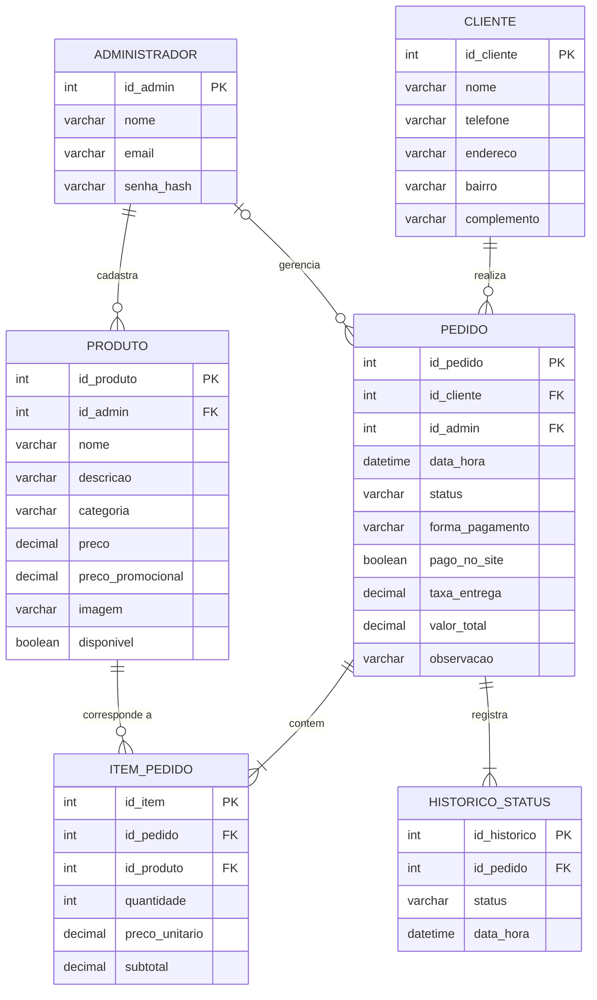

<p align="center">
  
</p>

<h1 align="center">Arte na Cozinha — Site de delivery próprio para confeitaria</h1>

<p align="center">
  Trabalho de Conclusão de Curso · Técnico em Desenvolvimento de Sistemas<br>
  <strong>Etec Fernando Prestes</strong> · Centro Paula Souza · Sorocaba · 2026<br>
  Thiago Luís · Adrian Martins · Henrique Petrone
</p>

---

## Sobre o projeto

Site de delivery **exclusivo da confeitaria Arte na Cozinha**, que funciona de forma parecida com o iFood,
mas **sem comissão por pedido**. O cliente consulta o cardápio, monta o carrinho, faz o pedido **sem cadastro**,
escolhe pagar **pelo site ou na entrega** e acompanha o status em tempo real. A confirmação é feita pelo
**WhatsApp**. A loja gerencia pedidos, produtos, preços e promoções em um **painel administrativo**.

| Tela do cliente | Painel da loja |
|---|---|
| Cardápio com busca, categorias e promoção da semana (Figura 8) | Pedidos do dia com indicadores e ações (Figura 11) |
| Carrinho e finalização sem cadastro (Figura 9) | Produtos e preços (cadastrar, editar, ocultar, excluir) |
| Acompanhamento do pedido em tempo real (Figura 10) | Promoções e banner da semana |
| Aviso de privacidade (LGPD) | Configurações: loja aberta/fechada, taxa, WhatsApp, senha |

## Tecnologias (Quadro 18)

| Tecnologia | Uso no projeto |
|---|---|
| **HTML5** | Estrutura das páginas |
| **CSS3** | Identidade visual, responsividade (mobile-first) |
| **JavaScript** | Carrinho, filtros, pesquisa, pagamento simulado, atualização em tempo real |
| **PHP 8** | Back-end: regras de negócio, API de pedidos, painel administrativo |
| **MySQL / MariaDB** | Banco de dados relacional (DER da seção 5.2) |
| **Git e GitHub** | Controle de versões |
| **WhatsApp (link de conversa)** | Confirmação dos pedidos (RF08) |

Sem frameworks nem bibliotecas externas: todo o código foi escrito pelo grupo, o que facilita explicar
cada parte na apresentação.

## Como rodar no computador (XAMPP)

1. Instale o [XAMPP](https://www.apachefriends.org/) e copie esta pasta para `C:\xampp\htdocs\`.
2. No painel do XAMPP, clique em **Start** no **Apache** e no **MySQL**.
3. Abra `http://localhost/phpmyadmin` → aba **Importar** → escolha `database/arte_na_cozinha.sql` → **Executar**.
   (ou pelo terminal: `C:\xampp\mysql\bin\mysql.exe -u root < database\arte_na_cozinha.sql`)
4. Acesse o site: **http://localhost/artes-na-cozinha/**
5. Acesse o painel: **http://localhost/artes-na-cozinha/admin/**

### Acesso de demonstração ao painel

| E-mail | Senha |
|---|---|
| `admin@artenacozinha.com.br` | `Arte@2026` |


## Estrutura de pastas

```
artes-na-cozinha/
├── index.php              Cardápio digital (página inicial)
├── carrinho.php           Carrinho e finalização do pedido
├── acompanhar.php         Acompanhamento do pedido
├── privacidade.php        Aviso de privacidade (LGPD)
├── api/
│   ├── pedido.php         Registra o pedido (POST JSON)
│   └── status.php         Status atual do pedido (tempo real)
├── admin/                 Painel administrativo
│   ├── login.php · sair.php
│   ├── index.php          Pedidos (Figura 11)
│   ├── pedido.php         Detalhes do pedido / comanda
│   ├── acao_pedido.php    Atualiza o status do pedido
│   ├── produtos.php · produto_form.php
│   ├── promocoes.php · configuracoes.php
│   └── api_novos.php      Aviso de pedido novo
├── includes/              Código compartilhado (não acessível pelo navegador)
│   ├── config.php         Configuração do banco
│   ├── bootstrap.php      Conexão, sessão, funções e segurança
│   ├── auth.php           Login do administrador
│   └── cabecalho/rodape, admin_topo/admin_rodape, icones
├── assets/
│   ├── css/style.css      Estilos do site (Apêndice A)
│   ├── css/admin.css      Estilos do painel
│   ├── js/                carrinho, cardápio, finalização, acompanhamento, painel
│   └── img/               Logotipo (SVG) e imagens ilustrativas dos produtos
├── uploads/produtos/      Fotos enviadas pelo painel
├── database/arte_na_cozinha.sql   Criação do banco + dados de exemplo
├── scripts/gerar_imagens.js       Gera os SVGs da logo e dos produtos
└── docs/                  Guia de publicação e roteiro de apresentação
```

## Banco de dados (DER — seção 5.2)

As cinco entidades do DER foram criadas com **exatamente** os atributos dos Quadros 10 a 14.
Duas tabelas de apoio foram adicionadas: `historico_status` (horários da linha do tempo do
acompanhamento) e `configuracao` (dados da loja editáveis no painel).



## Requisitos funcionais atendidos (Quadro 9)

| Código | Requisito | Onde está |
|---|---|---|
| RF01 | Realizar pedido sem cadastro | `carrinho.php`, `api/pedido.php` |
| RF02 | Carrinho de compras | `assets/js/carrinho.js`, `assets/js/finalizar.js` |
| RF03 | Acompanhar pedido | `acompanhar.php`, `api/status.php`, `assets/js/acompanhar.js` |
| RF04 | Pagar pelo site ou na entrega | `carrinho.php` (alternador) |
| RF05 | PIX, cartão e dinheiro (dinheiro só na entrega) | `carrinho.php`, validado em `api/pedido.php` |
| RF06 | Pesquisar produtos e ver promoções | `index.php`, `assets/js/cardapio.js` |
| RF07 | Filtrar por categoria | `index.php`, `assets/js/cardapio.js` |
| RF08 | Confirmação pelo WhatsApp | `acompanhar.php`, `admin/acao_pedido.php` |
| RF09 | Autenticar administrador | `admin/login.php`, `includes/auth.php` |
| RF10 | Gerenciar produtos, preços e promoções | `admin/produtos.php`, `admin/produto_form.php`, `admin/promocoes.php` |
| RF11 | Gerenciar pedidos | `admin/index.php`, `admin/pedido.php`, `admin/acao_pedido.php` |

## Requisitos não funcionais

- **RNF07/RNF08 – Compatibilidade e responsividade:** layout mobile-first, testado em 375 px (celular), 800 px (tablet) e 1440 px (computador); no painel, as tabelas viram cartões no celular.
- **RNF09 – Desempenho:** sem frameworks, imagens em SVG leves, cache e compressão no `.htaccess`.
- **RNF10 – Segurança:** senhas com `password_hash` (bcrypt), consultas preparadas (PDO) contra SQL Injection, `htmlspecialchars` contra XSS, token CSRF em todos os formulários, limite de tentativas de login, pastas internas bloqueadas e opção de forçar HTTPS.
- **RNF11 – Privacidade (LGPD):** coleta só do necessário para a entrega, aviso de privacidade e link de acompanhamento com código, para que ninguém veja o pedido de outra pessoa.
- **RNF13 – Comunicação:** o resumo para o WhatsApp é gerado logo após a finalização.

## Plano de testes (Quadro 21)

| Código | Caso de teste | Situação |
|---|---|---|
| CT01 | Adicionar e remover produtos do carrinho | ✅ Aprovado |
| CT02 | Pesquisar pelo nome e filtrar por categoria | ✅ Aprovado |
| CT03 | Finalizar pedido sem cadastro | ✅ Aprovado |
| CT04 | Finalizar com campo obrigatório vazio | ✅ Aprovado (aviso exibido, pedido não registrado) |
| CT05 | Pagar com PIX, cartão e dinheiro | ✅ Aprovado (pagamento on-line simulado) |
| CT06 | Receber confirmação pelo WhatsApp | ✅ Aprovado (link com resumo gerado) |
| CT07 | Acessar o painel com senha incorreta | ✅ Aprovado (acesso negado) |
| CT08 | Cadastrar, editar e remover produto | ✅ Aprovado |
| CT09 | Atualizar status → cliente vê o novo status | ✅ Aprovado (atualização automática) |
| CT10 | Abrir em celular Android e iPhone | ✅ Aprovado em simulação de 375 px; falta testar em aparelhos reais |
| CT11 | Página inicial em até 3 s no 4G | ⏳ Medir após publicar (Lighthouse do Chrome) |

## Observações

- O **pagamento on-line é simulado** (tela de PIX e cartão de demonstração). Na versão final, ele deve ser integrado a um meio de pagamento (Mercado Pago, PagSeguro etc.), conforme o Quadro 4.
- Produtos, nomes, preços e imagens são **ilustrativos**, como nas Figuras 8 a 11 do TCC.
- O logotipo é o **provisório** da seção 7.1.1, recriado em SVG vetorial.
